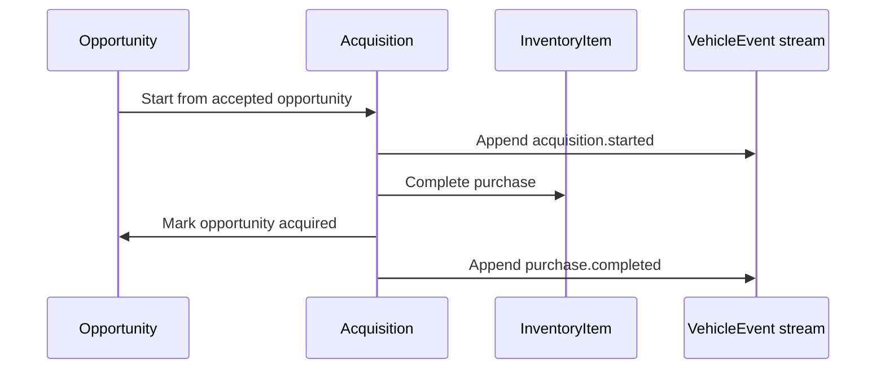

# Acquisition lifecycle

The acquisition boundary turns an accepted decision into owned inventory without losing the
evidence trail.

## Invariants

- Only an accepted opportunity can start an acquisition.
- An opportunity can create at most one acquisition.
- A completed or cancelled acquisition cannot be completed.
- Completing an acquisition creates exactly one inventory item in the opportunity target market.
- `acquisition.started` and `purchase.completed` are appended to vehicle history in the same
  database transaction as their state changes.
- Event payloads contain identifiers, price, currency and owning market needed for later audit.
