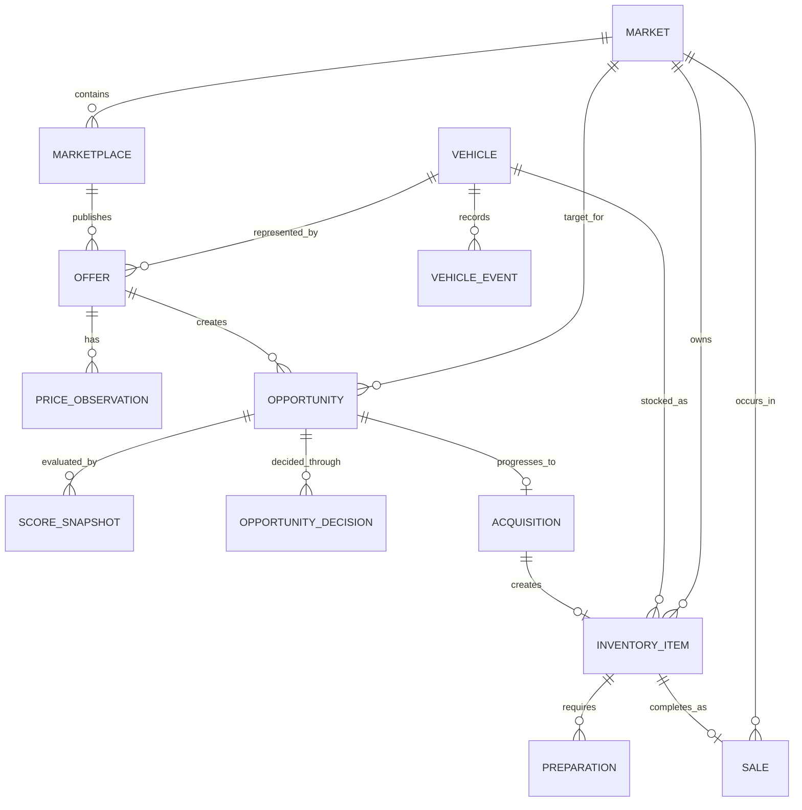

# Domain Core ER diagram

The four history streams (`PRICE_OBSERVATION`, `SCORE_SNAPSHOT`, `OPPORTUNITY_DECISION`, `VEHICLE_EVENT`) are append-only. This is event-driven state history, not full event sourcing: current aggregate state remains queryable in its own table.
