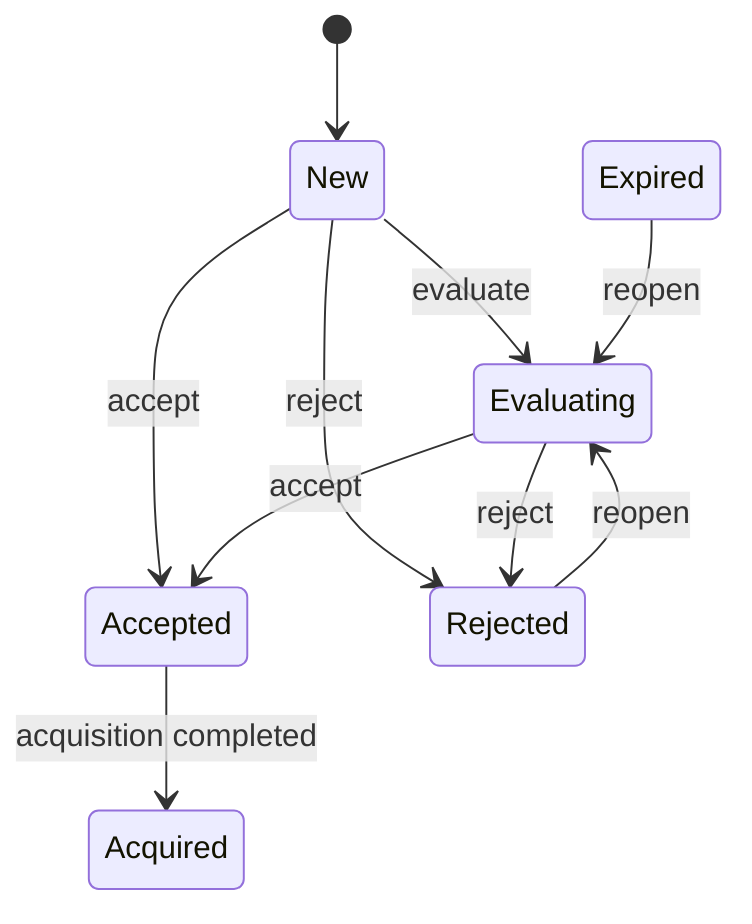

# Opportunity lifecycle

Every command is checked against the current state. Every business decision is appended to
`opportunity_decisions`; changing current state never rewrites the history that produced it.

Score calculation is a separate command. It invokes the existing Scoring Engine and appends a
`score_snapshots` record containing the score type, configuration version, normalized factor
weights, weighted contribution of every available factor, explanations and missing factors.
